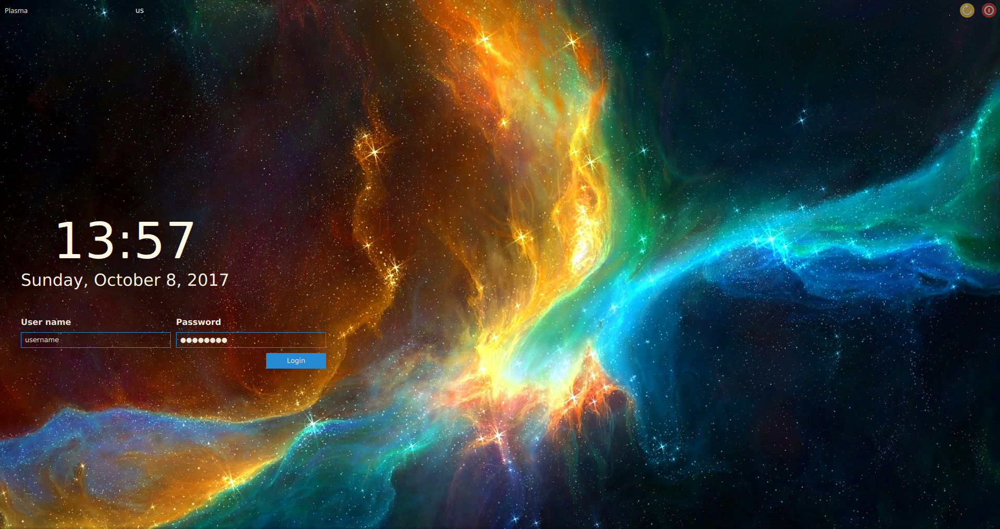

# nebula-sddm-theme
Nebula Theme for SDDM.

This theme was inspired by 3ximus' awesome [Abstract Dark](https://github.com/3ximus/abstractdark-sddm-theme) theme.

### Changing font in `theme.conf`:

example:
```
[General]
background=background.png
displayFont="FiraCode"
```

## Screenshot 




## Manual Installation

- copy the folder nebula to /usr/share/sddm/themes
- open SDDM settings and select nebula or...
- ...change CurrentTheme to nebula in /etc/sddm.conf 

### A Note on dependencies

- If the date is displaying in an small font you may be required to install the ttf-droid font 
- In case ttf-droid font is installed but date is still displaying small you may be required to install Powerline for Python2
- alternatively chose a different font by changing the `theme.conf` file

## License

Theme is licensed under [CC BY-SA 2.0](https://creativecommons.org/licenses/by-sa/2.0/)

